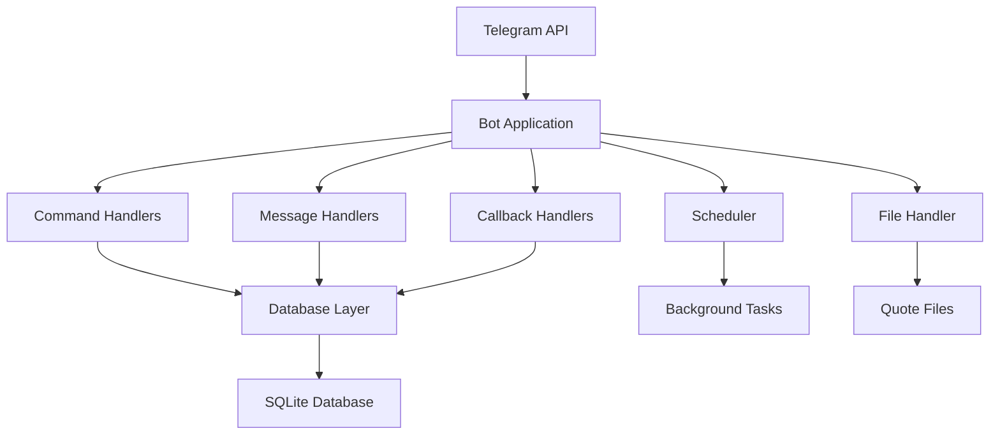

# Design Document

## Overview

@donhustle_bot is a Python-based Telegram bot built using the `python-telegram-bot` library. The bot implements a mafia-themed group management system with advanced features for moderation, automation, and user engagement. The architecture follows a modular design pattern with separate handlers for different functionalities, a SQLite database for persistence, and a configuration system for customizable behavior.

## Architecture

### High-Level Architecture



### Core Components

1. **Bot Application**: Main application using `python-telegram-bot` framework
2. **Handler System**: Modular command and message handlers
3. **Database Layer**: SQLite database with ORM-like interface
4. **Scheduler**: Background task scheduler for reminders and automated quotes
5. **File Processing**: Multi-format file parser for quote uploads
6. **Configuration Manager**: Runtime configuration and settings management

## Components and Interfaces

### 1. Bot Core (`bot.py`)

**Purpose**: Main application entry point and bot initialization

**Key Methods**:
- `initialize_bot()`: Set up bot with token and handlers
- `setup_handlers()`: Register all command and message handlers
- `run_bot()`: Start polling or webhook mode

**Dependencies**: 
- `telegram.ext.Application`
- Handler modules
- Database connection

### 2. Command Handlers (`handlers/commands.py`)

**Purpose**: Process all bot commands with mafia-themed responses

**Key Classes**:
- `CommandHandler`: Base class for command processing
- `WelcomeHandler`: Manages welcome messages and rules
- `QuoteHandler`: Handles quote-related commands
- `ReminderHandler`: Manages reminder functionality
- `ModerationHandler`: Handles user management and anti-spam

**Key Methods**:
- `handle_start()`: Welcome message and help
- `handle_welcome()`: Configure welcome messages
- `handle_upload_quotes()`: Process uploaded quote files
- `handle_remind()`: Create reminders
- `handle_inactive_management()`: Configure inactive user settings

### 3. Message Processing (`handlers/messages.py`)

**Purpose**: Process regular messages for counting, filtering, and automated responses

**Key Methods**:
- `process_message()`: Main message processing pipeline
- `count_message()`: Track message count for quote intervals
- `check_spam()`: Anti-spam filtering
- `track_user_activity()`: Update user activity timestamps

### 4. Database Layer (`database/`)

**Purpose**: Data persistence and management

**Schema Design**:

```sql
-- Quotes table
CREATE TABLE quotes (
    id INTEGER PRIMARY KEY AUTOINCREMENT,
    quote TEXT NOT NULL,
    created_at TIMESTAMP DEFAULT CURRENT_TIMESTAMP
);

-- Saved messages table
CREATE TABLE saved_messages (
    id INTEGER PRIMARY KEY AUTOINCREMENT,
    chat_id INTEGER NOT NULL,
    message_id INTEGER NOT NULL,
    content TEXT NOT NULL,
    tag TEXT,
    saved_by INTEGER NOT NULL,
    created_at TIMESTAMP DEFAULT CURRENT_TIMESTAMP
);

-- Reminders table
CREATE TABLE reminders (
    id INTEGER PRIMARY KEY AUTOINCREMENT,
    chat_id INTEGER NOT NULL,
    user_id INTEGER NOT NULL,
    message TEXT NOT NULL,
    remind_time TIMESTAMP NOT NULL,
    is_recurring BOOLEAN DEFAULT FALSE,
    recurrence_pattern TEXT,
    is_active BOOLEAN DEFAULT TRUE,
    created_at TIMESTAMP DEFAULT CURRENT_TIMESTAMP
);

-- User activity table
CREATE TABLE user_activity (
    user_id INTEGER PRIMARY KEY,
    chat_id INTEGER NOT NULL,
    last_activity TIMESTAMP DEFAULT CURRENT_TIMESTAMP,
    message_count INTEGER DEFAULT 0
);

-- Custom commands table
CREATE TABLE custom_commands (
    id INTEGER PRIMARY KEY AUTOINCREMENT,
    chat_id INTEGER NOT NULL,
    command_name TEXT NOT NULL,
    response TEXT NOT NULL,
    created_by INTEGER NOT NULL,
    created_at TIMESTAMP DEFAULT CURRENT_TIMESTAMP
);

-- Configuration table
CREATE TABLE config (
    chat_id INTEGER NOT NULL,
    key TEXT NOT NULL,
    value TEXT NOT NULL,
    PRIMARY KEY (chat_id, key)
);

-- Spam filters table
CREATE TABLE spam_filters (
    id INTEGER PRIMARY KEY AUTOINCREMENT,
    chat_id INTEGER NOT NULL,
    filter_word TEXT NOT NULL,
    action TEXT DEFAULT 'warn'
);
```

**Key Classes**:
- `DatabaseManager`: Main database interface
- `QuoteRepository`: Quote CRUD operations
- `MessageRepository`: Saved message operations
- `ReminderRepository`: Reminder management
- `ConfigRepository`: Configuration management

### 5. File Processing (`utils/file_processor.py`)

**Purpose**: Handle multiple file formats for quote uploads

**Supported Formats**:
- `.txt`: One quote per line
- `.csv`: Quote column extraction
- `.json`: Array of quote strings

**Key Methods**:
- `process_file()`: Main file processing entry point
- `parse_txt()`: Plain text file parsing
- `parse_csv()`: CSV file parsing with pandas
- `parse_json()`: JSON array parsing
- `validate_quotes()`: Quote content validation

### 6. Scheduler (`utils/scheduler.py`)

**Purpose**: Background task management for reminders and automated quotes

**Key Features**:
- Reminder scheduling and execution
- Automated quote sending based on message intervals
- Inactive user detection and warnings
- Recurring task management

**Key Methods**:
- `schedule_reminder()`: Add new reminder
- `check_reminders()`: Process due reminders
- `send_interval_quote()`: Send quotes based on message count
- `check_inactive_users()`: Identify and warn inactive users

### 7. Mafia Theme Engine (`utils/theme.py`)

**Purpose**: Centralized mafia-themed message generation

**Key Features**:
- Template-based response system
- Contextual phrase selection
- Tone adjustment (serious/humorous)
- Localization support (Spanish)

**Message Categories**:
- Welcome messages
- Warning messages
- Success confirmations
- Error messages
- Motivational quotes

## Data Models

### Quote Model
```python
@dataclass
class Quote:
    id: int
    quote: str
    created_at: datetime
```

### Reminder Model
```python
@dataclass
class Reminder:
    id: int
    chat_id: int
    user_id: int
    message: str
    remind_time: datetime
    is_recurring: bool
    recurrence_pattern: str
    is_active: bool
```

### SavedMessage Model
```python
@dataclass
class SavedMessage:
    id: int
    chat_id: int
    message_id: int
    content: str
    tag: str
    saved_by: int
    created_at: datetime
```

## Error Handling

### Error Categories

1. **API Errors**: Telegram API rate limits, network issues
2. **File Processing Errors**: Invalid file formats, corrupted uploads
3. **Database Errors**: Connection issues, constraint violations
4. **Permission Errors**: Insufficient bot permissions
5. **User Input Errors**: Invalid command parameters

### Error Response Strategy

- All errors wrapped in mafia-themed messages
- Graceful degradation for non-critical features
- Logging for debugging and monitoring
- User-friendly error messages with suggested actions

**Example Error Messages**:
- File upload error: "Capo, ese archivo no es de la familia. Sube un .txt, .csv o .json válido."
- Permission error: "Don Hustle necesita más poder en este grupo. Hazme administrador, capo."
- Database error: "Los libros de la familia están ocupados. Inténtalo en un momento, capo."

## Testing Strategy

### Unit Testing
- Individual handler testing with mock Telegram updates
- Database operation testing with in-memory SQLite
- File processing testing with sample files
- Theme engine testing for message generation

### Integration Testing
- End-to-end command flow testing
- Database integration testing
- File upload and processing workflows
- Scheduler and background task testing

### Test Data
- Sample quote files in all supported formats
- Mock Telegram update objects
- Test database with sample data
- Mafia-themed test messages

### Testing Tools
- `pytest` for test framework
- `unittest.mock` for mocking Telegram API
- `pytest-asyncio` for async test support
- `coverage.py` for test coverage reporting

## Security Considerations

### Bot Token Security
- Environment variable storage
- No hardcoded tokens in source code
- Secure deployment practices

### Data Privacy
- Minimal data collection
- User consent for data storage
- GDPR compliance for EU users
- Data retention policies

### Input Validation
- File upload size limits
- Content sanitization
- SQL injection prevention
- Command parameter validation

### Rate Limiting
- Message processing throttling
- API call rate limiting
- Spam detection and prevention
- User action cooldowns

## Deployment Architecture

### Development Environment
- Local SQLite database
- Polling mode for development
- Environment-based configuration
- Hot reload for development

### Production Environment
- Webhook mode for better performance
- Persistent database storage
- Process monitoring and restart
- Logging and error tracking

### Hosting Options
1. **Heroku**: Simple deployment with add-ons
2. **AWS EC2**: Full control with custom setup
3. **VPS**: Cost-effective with manual configuration
4. **Docker**: Containerized deployment

### Configuration Management
- Environment variables for sensitive data
- JSON configuration files for bot settings
- Database-stored per-chat configurations
- Runtime configuration updates

## Performance Considerations

### Database Optimization
- Indexed queries for frequent operations
- Connection pooling for concurrent access
- Query optimization for large datasets
- Regular database maintenance

### Memory Management
- Efficient file processing for large uploads
- Message caching strategies
- Background task cleanup
- Resource monitoring

### Scalability
- Horizontal scaling with multiple bot instances
- Database sharding for large deployments
- CDN for file storage
- Load balancing for webhook endpoints